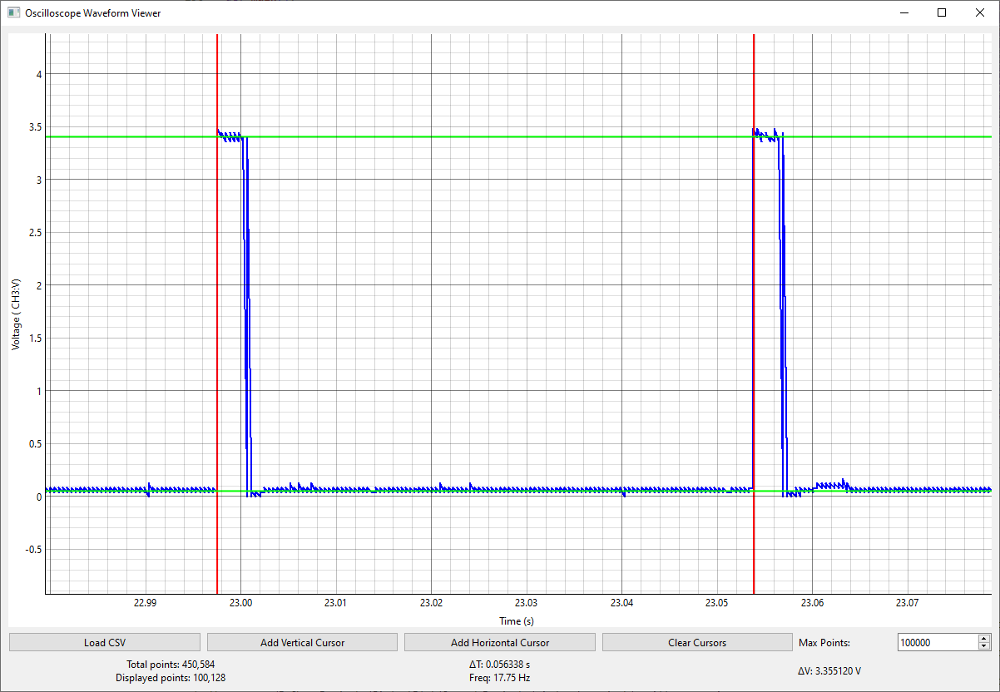

# Oscilloscope Waveform Viewer

A Python-based desktop application for visualizing and analyzing oscilloscope waveform data from CSV files. Built using PySide6 and pyqtgraph for high-performance interactive visualization.



## Features

- Fast loading and visualization of large CSV files (10MB+)
- Smart data decimation for smooth performance with large datasets
- Interactive waveform plotting with zoom and pan
- Movable cursors with intuitive mouse interaction:
  - Vertical cursors (red) with horizontal movement indicators
  - Horizontal cursors (green) with vertical movement indicators
- Real-time measurements:
  - Delta time (ΔT) between vertical cursors
  - Frequency calculation (1/ΔT)
  - Voltage difference (ΔV) between horizontal cursors
- Adjustable display resolution (points shown)
- Drag and drop file loading

## Installation

1. Create a virtual environment (recommended):
```bash
python -m venv venv
source venv/bin/activate  # On Windows: venv\Scripts\activate
```

2. Install dependencies:
```bash
pip install -r requirements.txt
```

## Usage

1. Run the application:
```bash
python oscilloscope_viewer.py
```

2. Use the interface:
   - Click "Load CSV" to open your oscilloscope data file
   - Add cursors using the buttons
   - Drag cursors by hovering over them (cursor will change to indicate movability)
   - Adjust the "Max Points" value to balance between performance and detail
   - Use mouse wheel to zoom and right-click drag to pan

## Supported File Formats

The application supports the following file formats:

### Oscilloscope Formats
- **Batronix CSV**
  - Standard format with time and voltage data
  - Identified by header containing 'time difference to trigger in s'

- **Batronix Display Data CSV**
  - Contains min/max envelopes
  - Identified by headers containing 'time in s' with 'minimum' and 'maximum' columns

- **Rigol Standard CSV**
  - Basic CSV format with Time(s) and channel data
  - Identified by header starting with 'Time(s),CH1V'

- **Rigol Arb CSV**
  - Advanced format with metadata
  - Identified by header containing 'RIGOL:CSV DATA FILE'

- **Siglent CSV**
  - Includes detailed metadata
  - Identified by headers containing 'Record Length' and 'Model Number'

### General Purpose Formats
- **PyQtGraph CSV**
  - Simple two-column format (time, value)
  - Compatible with PyQtGraph's CSV export
  - Automatically detected by header format (x0000,y0000)

- **Binary Files**
  - Raw binary data import with configurable settings
  - Supports various data types and endianness
  - Accessible through the "Import Binary..." option

The application will automatically detect the file format and parse it accordingly. For binary files, you'll be prompted to specify the data format.
